# BluePrints
📖 Actividades del laboratorio

### 1. Familiarización con el código base
   
#### - Revisa el paquete model con las clases Blueprint y Point.

La clase Blueprint representa un plano, que contiene una lista de
puntos (points) asociados a un autor (author), el cual identifica a
la persona dueña de ese plano. Además del autor, la clase también 
guarda un name para identificar el plano en sí.

Para acceder a estos datos, Blueprint expone sus getters 
correspondientes: getAuthor(), getName() y getPoints(). Este último 
no entrega la lista interna directamente, sino una vista de solo 
lectura, evitando que se modifique desde fuera de la clase.
La única forma de agregar puntos al plano es a través del método 
addPoint(Point p), que actúa como punto de control sobre la lista:
cualquier modificación debe pasar obligatoriamente por él, 
garantizando que el estado interno del Blueprint se mantenga 
consistente y protegido (encapsulamiento).

Cada elemento de esa lista es un objeto Point, definido como 
un record: una clase inmutable y compacta que solo almacena un 
par de coordenadas (x, y), y que obtiene automáticamente su
constructor, getters, equals(), hashCode() y toString().

#### - Entiende la capa persistence con InMemoryBlueprintPersistence.

Está compuesta por cuatro archivos: la interfaz
**BlueprintPersistence**, que define el contrato con las operaciones
disponibles (guardar un plano, buscarlo por autor y nombre, buscar 
todos los planos de un autor, traer todos los planos, y agregar un 
punto a un plano existente), para su implementación concreta esta la clase
**InMemoryBlueprintPersistence**, que guarda los datos en memoria 
usando un ConcurrentHashMap<String, Blueprint> esto nos permite tener 
varios usuarios al mismo tiempo, donde la clave es un texto 
generado como "author:name" mediante el método auxiliar keyOf, 
y que además precarga tres planos de ejemplo al iniciar la 
aplicación, tambien tenemos dos excepciones propias, **BlueprintNotFoundException**
(lanzada cuando se busca un plano que no existe) y 
**BlueprintPersistenceException** (lanzada cuando ocurre un error al 
guardar, como un plano duplicado), que permiten manejar los errores 
de forma específica en lugar de usar excepciones genéricas o devolver
null.

> La idea central de este diseño es que el resto de la aplicación
dependa únicamente de la interfaz BlueprintPersistence y no de la
clase concreta que la implementa, de modo que en el futuro se pueda
reemplazar el almacenamiento en memoria por una base de datos.

#### - Analiza la capa services (BlueprintsServices) y el controlador BlueprintsAPIController.

La clase BlueprintsAPIController es la capa web, que utiliza API REST del proyecto, esta recibe peticiones con los metodos
GET,POST,PUT. tambien estrae y valida estas peticiones, si cumple se las pasa a la clase
BlueprintsServices, esta es la capa de servicio actúa como intermediaria entre el Controller y la
capa de Persistence. En la mayoría de sus métodos simplemente delega la llamada directamente
a persistence (guardar, traer todos, traer por autor, agregar punto)

### **2. Migración a persistencia en PostgreSQL**

#### - Configura una base de datos PostgreSQL (puedes usar Docker).

1) Creamos el archivo docker-compose.yml
2) levantamos el contenedor.
> docker compose up -d
3) Verificamos que este corriendo.
> docker ps
4) confirmamos que podamos conectarnos
>  docker exec -it blueprints-postgres psql -U blueprints_user -d blueprints_db
5) Comandos utiles
>Para salir de esa terminal
> \q
> listar tablas
> \dt
> listar todas las bases de datos
> \l  

#### - Implementa un nuevo repositorio PostgresBlueprintPersistence que reemplace la versión en memoria.

1) Agregar dependencias al pom.xml: incorporamos spring-boot-starter-data-jpa para 
trabajar con JPA y Hibernate, y el driver postgresql para que Java pudiera comunicarse
con la base de datos.

2) Configurar la conexión en application.properties
3) Crear las entidades JPA: cree PointEntity y BlueprintEntity en un 
paquete nuevo llamado entity, ya que las clases originales del modelo 
(Point como record inmutable) no eran compatibles con los requisitos 
de JPA, que necesita clases mutables con constructor vacío e identificador. 
Quedaron relacionadas mediante una asociación uno a muchos entre Blueprint y sus puntos.

4) Crear el repositorio JPA: Se definio la interfaz BlueprintJpaRepository, 
que extiende JpaRepository y declara métodos de búsqueda que Spring Data
implementa automáticamente sin necesidad de escribir SQL manualmente.

5) Crear PostgresBlueprintPersistence: se construyó  la clase dentro del paquete persistence,
implementando la misma interfaz BlueprintPersistence que ya usaba la versión en memoria. 
Utiliza el repositorio JPA para guardar y consultar datos, e incluye métodos de mapeo 
para traducir entre las clases del modelo de dominio y las entidades JPA.

6) Aplicar profile a la clase **InMemoryBlueprintPersistence** y **PostgresBlueprintPersistence**.

7) Corremos la aplicación:

> mvn spring-boot:run

### 3. Buenas prácticas de API REST

- Usa códigos HTTP correctos

Estos fueron os cambios realizados:

1) getAll(), byAuthor(), byAuthorAndName() y addPoint(): no se tocaron ya usaban 200 para éxito y 404 para "no encontrado", que es justo lo que pedía el checklist. No había nada que corregir.
2) add(): Se realizo el cambio de 403 a 409, debido a que, 403 es un error de que no tengo permisos, y el 409 coincide con que el error sea que el recurso ya existe.
3) El error 400: no esta explicito, se genera con la notacion @valid que tenmos en el metodo NewBlueprintRequest.

## Códigos de respuesta HTTP

| Código | Nombre | Caso de uso | Endpoint(s) | Implementación en Java |
|--------|--------|--------------|-------------|--------------------------|
| `200`  | OK | Consulta exitosa | `GET /api/v1/blueprints`, `GET /api/v1/blueprints/{author}`, `GET /api/v1/blueprints/{author}/{bpname}` | `ResponseEntity.ok(...)` |
| `201`  | Created | Blueprint creado exitosamente | `POST /api/v1/blueprints` | `ResponseEntity.status(HttpStatus.CREATED).build()` |
| `202`  | Accepted | Punto agregado exitosamente | `PUT /api/v1/blueprints/{author}/{bpname}/points` | `ResponseEntity.status(HttpStatus.ACCEPTED).build()` |
| `400`  | Bad Request | Datos inválidos (`author` o `name` vacíos) | `POST /api/v1/blueprints` | Automático vía `@Valid` en `NewBlueprintRequest` |
| `404`  | Not Found | El blueprint solicitado no existe | `GET /api/v1/blueprints/{author}`, `GET /api/v1/blueprints/{author}/{bpname}`, `PUT /api/v1/blueprints/{author}/{bpname}/points` | `ResponseEntity.status(HttpStatus.NOT_FOUND).body(Map.of("error", e.getMessage()))` |
| `409`  | Conflict | Ya existe un blueprint con el mismo `author` y `name` | `POST /api/v1/blueprints` | `ResponseEntity.status(HttpStatus.CONFLICT).body(Map.of("error", e.getMessage()))` |

- Implementa una clase genérica de respuesta uniforme

ApiResponse<T> existe para que todos los endpoints de tu API respondan con la misma estructura 
(code, message, data), en lugar de que cada uno devuelva un formato distinto como pasaba antes 
(a veces un Blueprint directo, a veces un Map con "error", a veces nada)

4) OpenAPI / Swagger

> http://localhost:8080/swagger-ui.html

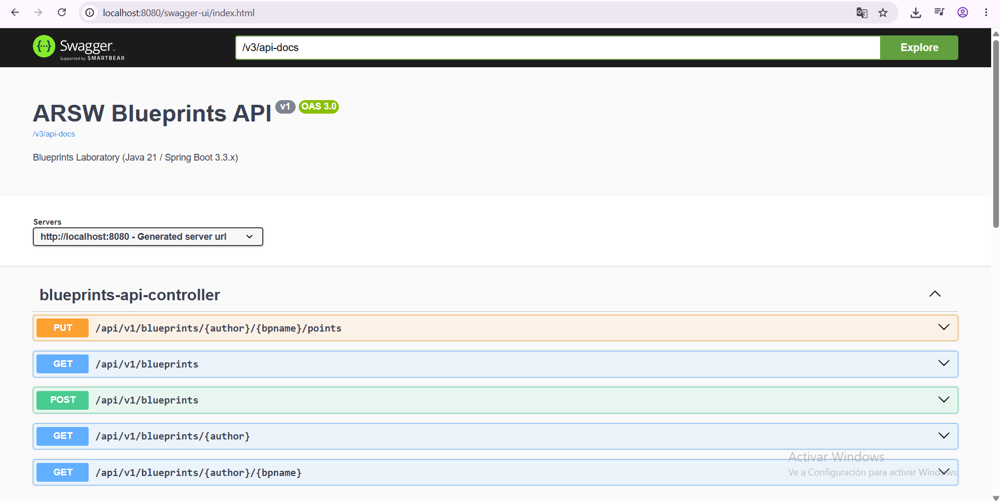

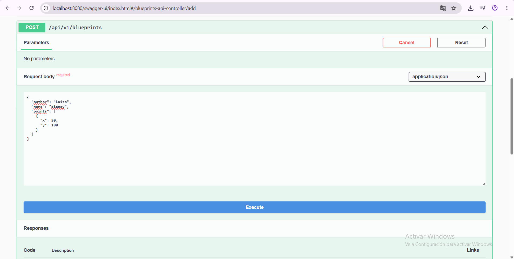

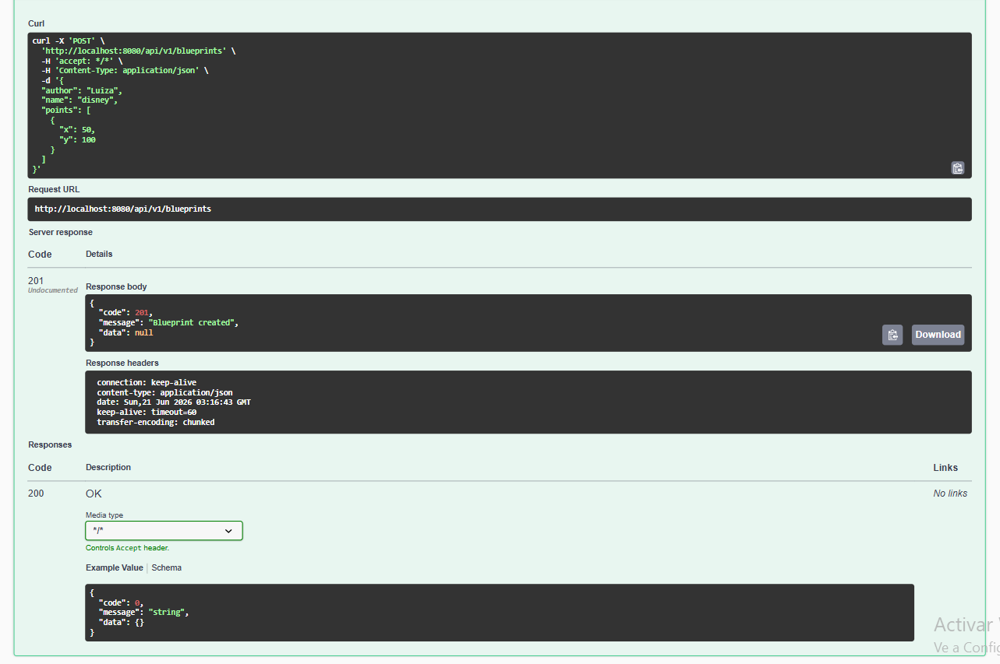

### **Anota endpoints con @Operation y @ApiResponse.**

### Documentación con OpenAPI/Swagger

Cada endpoint del controlador está anotado con **@Operation** y **@ApiResponses** / **@ApiResponse** (springdoc-openapi), 
lo que permite documentar de forma explícita qué hace cada endpoint y 
qué códigos de respuesta puede devolver (200, 201, 202, 400, 404, 409),
junto con una descripción de cada caso. Esta documentación se genera 
automáticamente en una interfaz interactiva disponible 
en **/swagger-ui.html**, donde es posible explorar y probar todos los
endpoints sin necesidad de herramientas externas como Postman.

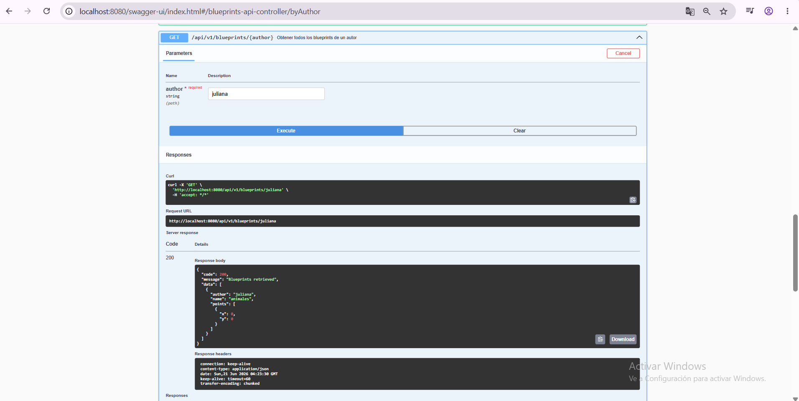

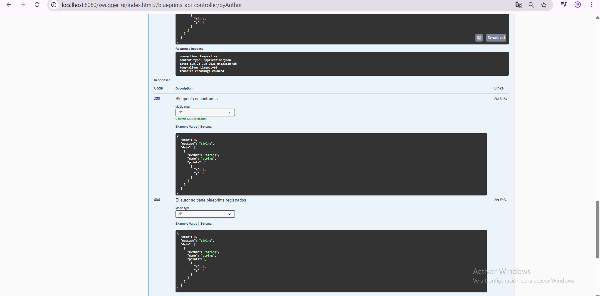

### **5. Filtros de Blueprints**

Implementa filtros:
* RedundancyFilter: elimina puntos duplicados consecutivos.
* UndersamplingFilter: conserva 1 de cada 2 puntos.

**Redundancy**

cuando se inicia el spring boot vemos en la terminal que se activo el perfil redundancy

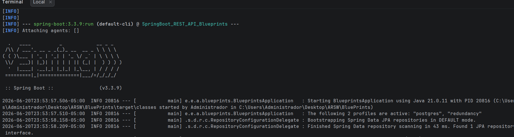

**Pruebas**

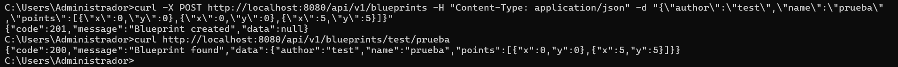
Aqui agregamos dos puntos (0,0) y en la consulta de este plano solo me aparece uno, lo cual podemos concluir que esta funcionando correctamente.

**Datos de prueba Redundancy**

> curl -X POST http://localhost:8080/api/v1/blueprints -H "Content-Type: application/json" -d "{\"author\":\"Juliana\",\"name\":\"animacion\",\"points\":[{\"x\":1,\"y\":1},{\"x\":1,\"y\":1},{\"x\":5,\"y\":5}]}"
> curl http://localhost:8080/api/v1/blueprints/Juliana/animacion

**Undersampling**

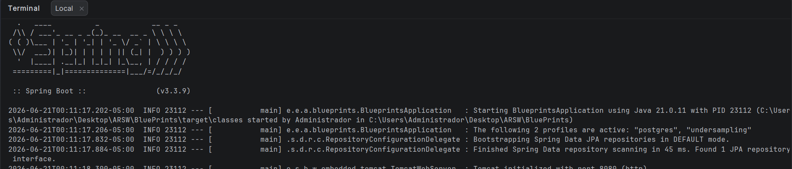
cuando se inicia el spring boot vemos en la terminal que se activo el perfil undersampling

**Pruebas**
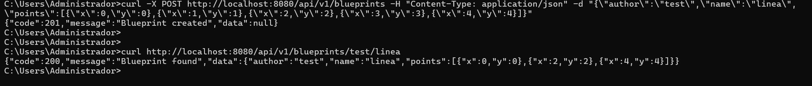
Aqui agregue puntos consecutivos que en si no aportan nada a lo que se quiera dibujar, cuando se consulta solo se evidencian los que permiten observar la figura.

**Datos de prueba undersampling**

> curl -X POST http://localhost:8080/api/v1/blueprints -H "Content-Type: application/json" -d "{\"author\":\"Alex\",\"name\":\"linea\",\"points\":[{\"x\":10,\"y\":10},{\"x\":11,\"y\":11},{\"x\":12,\"y\":12},{\"x\":13,\"y\":13},{\"x\":14,\"y\":14}]}"
> curl http://localhost:8080/api/v1/blueprints/Alex/linea

Los filtros RedundancyFilter y UndersamplingFilter existen para reducir la cantidad de puntos de un blueprint antes de devolverlo, 
cada uno con un propósito distinto: RedundancyFilter elimina puntos duplicados que aparecen de forma consecutiva 
(por ejemplo, errores de captura donde el mismo punto se registra varias veces seguidas), mientras que UndersamplingFilter reduce
la densidad general del trazo conservando solo uno de cada dos puntos, sin importar si son repetidos o no. Ambos se activan mediante
perfiles de Spring (redundancy y undersampling) y son mutuamente excluyentes, ya que el sistema solo permite tener un filtro
activo a la vez; cuando ninguno de los dos está activo, se usa IdentityFilter como comportamiento por defecto, que devuelve el blueprint sin ninguna transformación.

**Evidencia de consultas en Swagger UI y evidencia de mensajes en la base de datos.**

1) Verificamos que el contenedor este corriendo.
2) Entrar al cliente de PostgreSQL dentro del contenedor.
 >docker exec -it blueprints-postgres psql -U blueprints_user -d blueprints_db
3) Listamos las tablas.
 > \dt
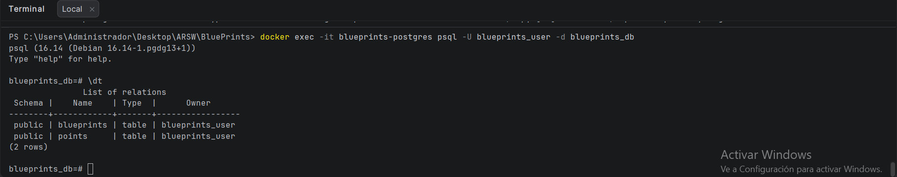
 > SELECT * FROM points;
 
 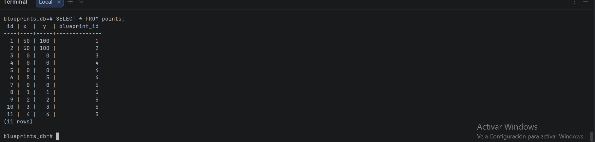
 > SELECT * FROM blueprints;
 
 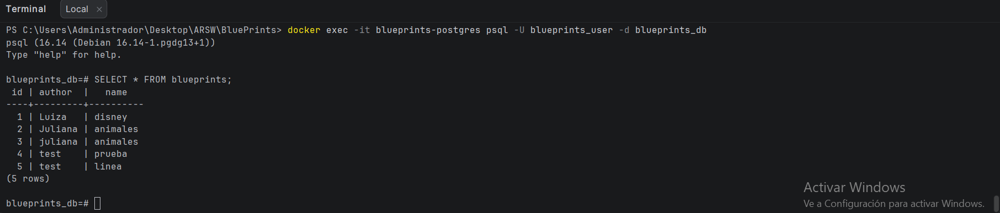

 > SELECT b.author, b.name, p.x, p.y
 FROM blueprints b
 JOIN points p ON p.blueprint_id = b.id
 ORDER BY b.author, b.name, p.id;
 
 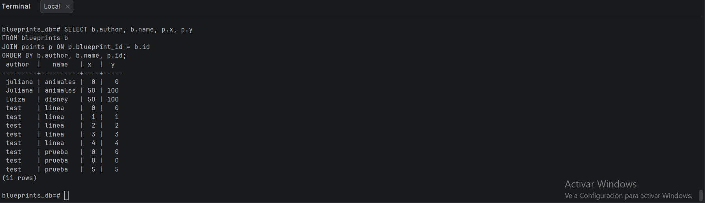

## Buenas prácticas aplicadas

- **Separación por capas (Controller → Service → Persistence)**: cada capa tiene una responsabilidad única. El controlador maneja HTTP, 
    el servicio orquesta la lógica de negocio (incluyendo el filtrado), y la persistencia se encarga exclusivamente del acceso a datos.

- **Uso de interfaces**: **BlueprintPersistence** y **BlueprintsFilter** son interfaces, el resto de la aplicación depende de 
    ellas y no de sus implementaciones concretas. Esto permitió migrar de almacenamiento en memoria a PostgreSQL, y alternar entre filtros,
    sin modificar el controlador ni el servicio.

- **Perfiles de Spring (@Profile)** para seleccionar implementaciones en tiempo de configuración (**memory**/**postgres** para persistencia,
    **redundancy**/**undersampling** para filtros), evitando condicionales explícitos en el código y permitiendo cambiar el comportamiento 
    de la aplicación solo editando **application.properties**.

- **Separación entre modelo de dominio y entidades de persistencia**: **Blueprint**/**Point** (records inmutables) se mantienen independientes 
    de **BlueprintEntity**/**PointEntity** (entidades JPA mutables), evitando que los detalles de la base de datos contaminen la lógica de negocio.

- **Manejo explícito de excepciones de negocio**: **BlueprintNotFoundExcepton** y **BlueprintPersistenceException** comunican errores específicos 
    del dominio, traducidos en el controlador a códigos HTTP (404, 409).

- **Respuesta uniforme de la API**: el record genérico **ApiResponse** iguala la forma de todas las respuestas (code, message, data),

- **Validación declarativa** con @Valid y @NotBlank en los DTOs de entrada, delegando en Spring la verificación de datos inválidos 
    (400 Bad Request) en lugar de validarlos manualmente en el controlador.

- **Documentación automática con OpenAPI/Swagger**, usando @Operation y @ApiResponse para describir cada endpoint y sus posibles
    respuestas directamente desde el código.

- **Transacciones explícitas (@Transactional)** en las operaciones de persistencia que modifican datos, y modo de solo lectura 
    (readOnly = true) en las consultas, optimizando el acceso a la base de datos.

### **Bonus**

#### * Imagen de contenedor (spring-boot:build-image).

1) Construimos la imagen
docker build -t blueprints-api .
2) Miramos si la imagen efectivamente se creo
docker images
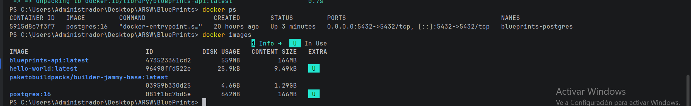

3) Vemos el nombre de la red

>docker network ls

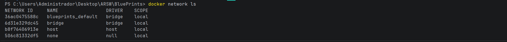

4) Corremos la imagen

>docker run -p 8080:8080 --network blueprints_default -e SPRING_DATASOURCE_URL=jdbc:postgresql://blueprints-postgres:5432/blueprints_db blueprints-api

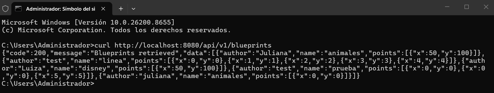

* #### **Métricas con Actuator.**

Agregamos la dependencia al pom.xml

> <dependency>
>     <groupId>org.springframework.boot</groupId>
>     <artifactId>spring-boot-starter-actuator</artifactId>
> </dependency>

